# Zuri Stage 2

An API service for a simple CRUD application

Live on Render [zuri-stage-two](https://otagera-zuri-stage-two.onrender.com/api)

## End-point: Index

### Method: GET

> ```
> {{baseUrl}}/api/:user_id
> ```

### Response (**raw**)

```json
{
  "message": "User fetched successfully",
  "user": {
    "id": 1,
    "firstName": "First",
    "lastName": "Last",
    "age": 50,
    "createdAt": "2023-09-12T09:42:58.777Z",
    "updatedAt": "2023-09-12T09:42:58.777Z"
  }
}
```

### Method: POST

> ```
> {{baseUrl}}/api
> ```

### Body (**raw**)

```json
{
  "firstName": "First",
  "lastName": "Last",
  "age": 50
}
```

### Response (**raw**)

```json
{
  "message": "User created successfully",
  "user": {
    "id": 3,
    "firstName": "First",
    "lastName": "Last",
    "age": 50,
    "updatedAt": "2023-09-12T09:43:24.214Z",
    "createdAt": "2023-09-12T09:43:24.214Z"
  }
}
```

### Method: PUT

> ```
> {{baseUrl}}/api/:user_id
> ```

### Body (**raw**)

```json
{
  "firstName": "First",
  "lastName": "Last",
  "age": 50
}
```

### Response (**raw**)

```json
{
  "message": "User updated successfully",
  "user": {
    "id": 3,
    "firstName": "First",
    "lastName": "Last",
    "age": 50,
    "updatedAt": "2023-09-12T09:43:24.214Z",
    "createdAt": "2023-09-12T09:43:24.214Z"
  }
}
```

### Method: DELETE

> ```
> {{baseUrl}}/api/:user_id
> ```

### Response (**raw**)

```json
{
  "message": "User deleted successfully",
  "user": {
    "id": 3,
    "firstName": "First",
    "lastName": "Last",
    "age": 50,
    "updatedAt": "2023-09-12T09:43:24.214Z",
    "createdAt": "2023-09-12T09:43:24.214Z"
  }
}
```


